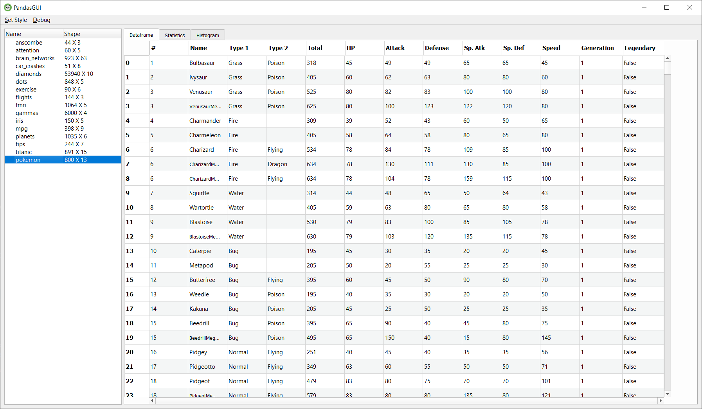
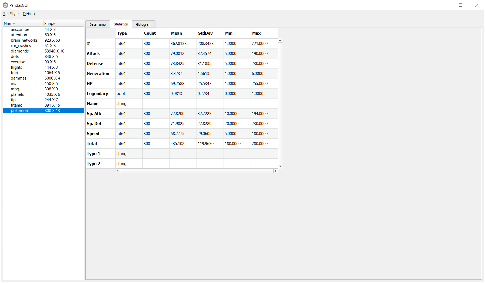
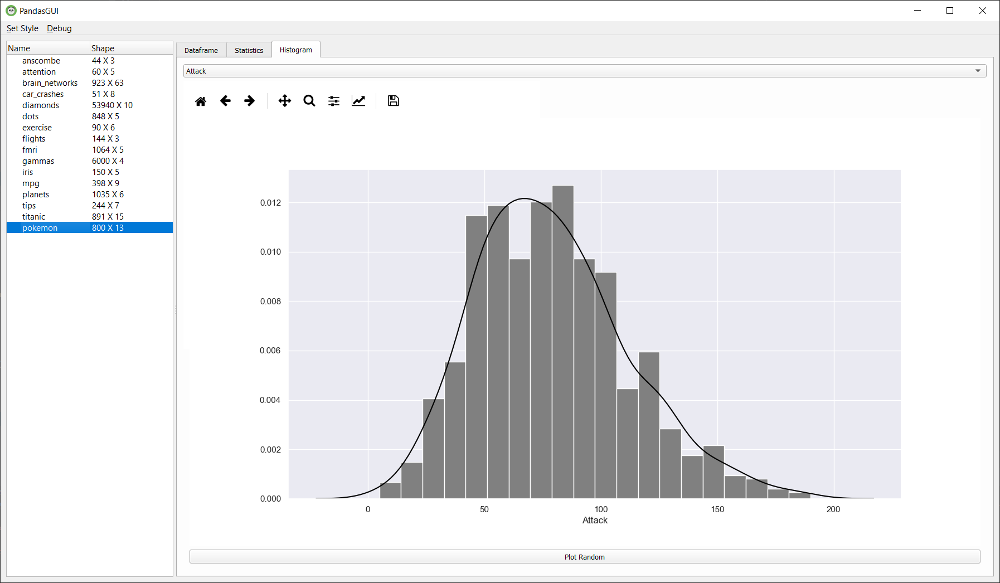

# PandasGUI

This project allows display and modification of Pandas DataFrames through a GUI based on PyQt5

## Installation

Run the following to install from PyPi:

```python
pip install pandasgui
```

Or install directly from Github for the latest changes.

```python
pip install git+https://github.com/adamerose/pandasgui.git
```


## Usage
View two DataFrames in PandasGUI
```python
import seaborn as sns
from pandasgui import show

iris = sns.load_dataset('iris')
flights = sns.load_dataset('flights')
show(iris,flights)

```

Example of MultiIndex support, renaming, and nonblocking mode. Nonblocking mode opens the GUI in a separate process and allows you to continue running code in the console
```python
import seaborn as sns
from pandasgui import show

flights = sns.load_dataset('flights')
multi = flights.set_index(['year', 'month']).unstack()  # MultiIndex example
show(flights, flightsReshaped=multi, nonblocking=True)

```

## About
This project is still in version 0.x.y and subject to major changes. Issues, feedback and forks are welcome. 

## Features
- View DataFrames and Series
- MultiIndex support
- Copy & Paste from GUI
- Import CSV files with drag & drop
- Tabs showing column statistics and histograms

## Requirements
- pandas
- PyQt5
- seaborn

## Gallery





